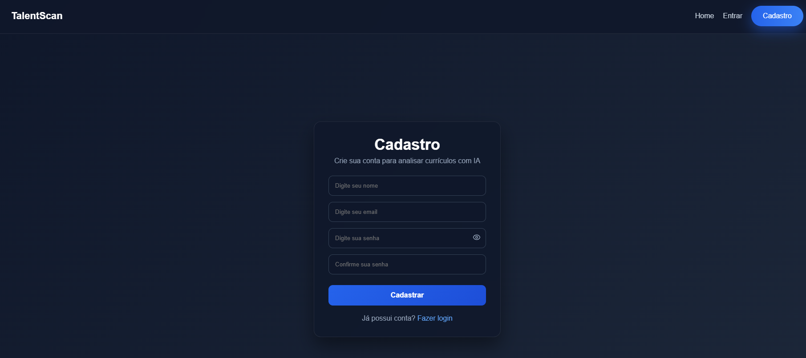
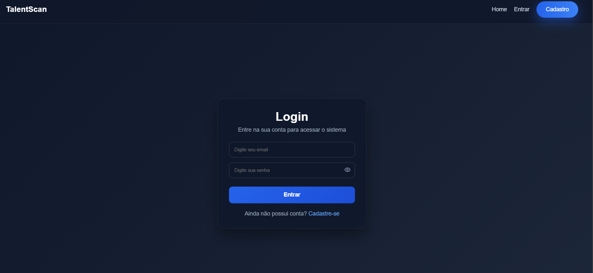
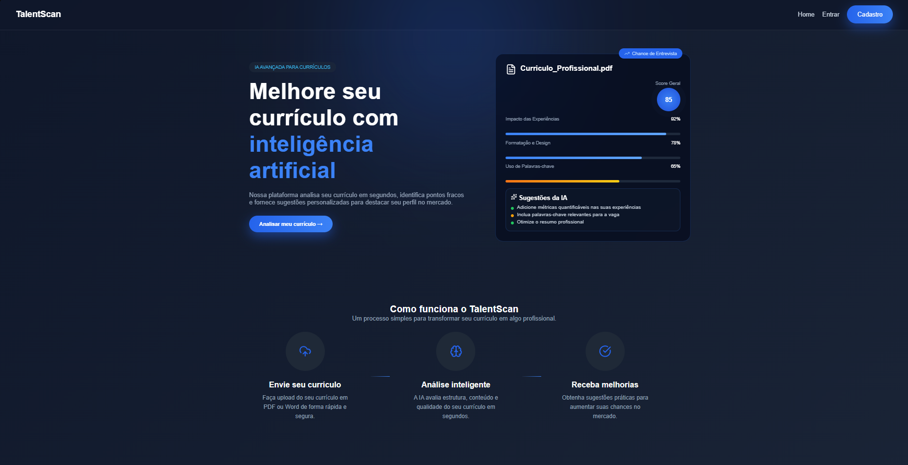
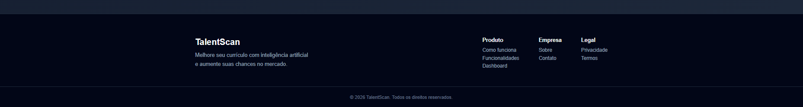

# 4. Projeto da Solução

> ⚠️ **Aviso aos Squads (Software House)**
>
> Esta seção **não deve ser preenchida integralmente antes da codificação**.
> Trata-se de um **Documento Vivo**, que deverá ser atualizado **incrementalmente a cada Sprint**, refletindo fielmente o código real implementado.

---

## 4.1 Arquitetura da Solução (Sprint 1 e 2)

Apresente um **diagrama macro** demonstrando como os componentes do sistema se comunicam.

A arquitetura deve refletir o modelo de **fatias verticais**, evidenciando o fluxo:

**Front-end → API (Back-end) → Banco de Dados**
 


## 4.2 Tecnologias Utilizadas

Descreva as tecnologias, linguagens, frameworks, bibliotecas e serviços escolhidos pelo Squad.

| Dimensão                               | Tecnologia Escolhida                         |
| -------------------------------------- | -------------------------------------------- |
| Banco de Dados (NoSQL)                 | MongoDB Atlas com Mongoose                   |
| Back-end (API)                         | Node.js com Express                          |
| Front-end                              | React (Vite) com JavaScript (JSX) e CSS      |
| Inteligência Artificial                | Google Generative AI (@google/generative-ai) |
| Upload e Processamento de Arquivos     | Multer, pdf-parse e Mammoth                  |
| Gerenciamento de Rotas (Front-end)     | React Router DOM                             |
| Interface e Experiência do Usuário     | SweetAlert2 e Lucide React                   |
| Gerenciamento de Variáveis de Ambiente | Dotenv                                       |
| Comunicação entre sistemas             | CORS                                         |
| Testes de API                          | Postman                                      |
| Prototipação de Interface              | Figma                                        |
| Gestão e Versionamento                 | GitHub e GitHub Projects (Kanban)            |


---

##  4.3 Wireframes ou Mockups (A partir da Sprint 2)

Apresente os protótipos das telas (Wireframes/Mockups) apenas das funcionalidades que estão sendo implementadas na Sprint atual.

Cada Wireframe ou Mockups devem estar associados a pelo menos:

- Um Requisito Funcional (RF-XX)
- Uma História de Usuário

## 📌 Tela de Cadastro (RF-01)

**História associada:** Como usuário, quero criar uma conta para acessar o sistema.



**Descrição:** A interface contempla todos os campos exigidos pelo RF-01, permitindo o cadastro do usuário de forma completa. Após a validação dos dados no backend, as informações são persistidas no banco de dados, garantindo a integridade do registro.

---


## 📌 Tela de Login (RF-02)

**História associada:** Como usuário, quero fazer login com meu e-mail e senha para acessar minha conta.



**Descrição:** A interface de login contempla todos os campos exigidos pelo RF-02, permitindo que o usuário informe seu e-mail e senha previamente cadastrados. Os dados são validados no backend e, em caso de sucesso, o usuário é autenticado e redirecionado para o dashboard. Em caso de erro, o sistema exibe mensagens de feedback informando credenciais inválidas.

---

## 📌 Tela de Envio de Currículo (RF-05)

**História associada:** Como usuário, eu quero enviar meu currículo para que ele seja analisado pelo sistema.


**Descrição:** A interface permite que o usuário envie seu currículo para análise, contemplando todos os requisitos do RF-05. O sistema aceita arquivos em formatos como PDF e DOCX, realiza o upload para o backend e processa o conteúdo do documento. Após o envio, o currículo é preparado para análise pela inteligência artificial, garantindo o correto tratamento das informações.

---


## 📌 Tela Inicial / Home (RF-09)

**História associada:** Como usuário, eu quero acessar a página inicial (Home) para visualizar e acessar as principais funcionalidades do sistema.





**Descrição:** A página inicial permite que o usuário visualize informações gerais do sistema e acesse funcionalidades como cadastro, login e envio de currículo. A interface contempla todos os requisitos do RF-09, funcionando como ponto de entrada da aplicação e facilitando a navegação do usuário.

---

## 4.4 Modelagem de Dados (Sprint 2 e 3)

O sistema exige persistência de dados.

A documentação do banco seguirá a abordagem de **entrega contínua**, sendo expandida conforme evolução do projeto.

---

### 4.4.1 Script Físico (Entrega na Sprint 2 - MVP)

Para a primeira fatia vertical (MVP), o Squad deverá entregar o **script de criação das tabelas ou coleções utilizadas**.

---

### Para Banco NoSQL

Incluir a estrutura dos documentos JSON (Schema).

**users:**

```json
{
  {
  "_id": {
    "$oid": "69d148cf7e3beb9fd7ab3fc8"
  },
  "name": "Junio",
  "email": "junio@teste.com",
  "password": "123456",
  "createdAt": {
    "$date": "2026-04-04T17:22:23.049Z"
  },
  "__v": 0
}
}
```
**analises:**

```json
{
  {
  "_id": {
    "$oid": "69d2cd2cc86d4f38a9e496d8"
  },
  "nomeArquivo": "curic.docx",
  "texto": "Washington JúnioEmail: washington.junio@email.comTelefone: (31) 99999-9999LinkedIn: linkedin.com/in/washingtonjunioGitHub: github.com/washingtonjunioBelo Horizonte – MG\n\n\n\nResumo Profissional\n\nEstudante de Tecnologia da Informação com foco em desenvolvimento de software e aplicações web. Possui experiência prática na construção de sistemas full stack utilizando JavaScript, Node.js, Express e React. Atua com bancos de dados relacionais e não relacionais, com ênfase em MongoDB.\n\nTem interesse em inteligência artificial aplicada, análise de dados e desenvolvimento de soluções escaláveis. Participa de projetos acadêmicos voltados para resolução de problemas reais, sempre buscando boas práticas de código, organização e experiência do usuário.\n\n\n\nCompetências Técnicas\n\nLinguagens: JavaScript (ES6+), C#, HTML5, CSS3, SQLFrameworks e Bibliotecas: React.js, Node.js, Express.js, Bootstrap, SweetAlert2Banco de Dados: MongoDB (Mongoose), MySQLFerramentas: Git, GitHub, VS Code, Figma, PostmanConceitos: APIs REST, CRUD, MVC, Programação Orientada a Objetos, Estruturas de Dados, NoSQL vs SQL, ACID e BASE\n\n\n\nProjetos\n\nTalentScan – Sistema de Análise de Currículos com IADesenvolvimento de aplicação web para análise automatizada de currículos utilizando inteligência artificial.Front-end desenvolvido em React com Vite, com interface moderna inspirada em aplicações SaaS.Back-end em Node.js com Express e integração com MongoDB Atlas.Implementação de sistema de autenticação com armazenamento de dados de usuários.Criação de interface interativa com feedback visual utilizando SweetAlert2.Estruturação do projeto em arquitetura organizada (controllers, models, routes e services).\n\nEcoArtes – Plataforma de Produtos SustentáveisDesenvolvimento de plataforma web para divulgação e venda de produtos artesanais e ecológicos.Foco em sustentabilidade, consumo consciente e valorização de produtores locais.Implementação de interface amigável e intuitiva voltada para experiência do usuário.\n\nSistema de Gerenciamento de ProdutosAplicação para controle de estoque com funcionalidades de cadastro, edição e exclusão de produtos.Utilização de lógica de programação para manipulação de dados e organização de informações.\n\n\n\nFormação Acadêmica\n\nGraduação em Análise e Desenvolvimento de Sistemas(Em andamento)\n\n\n\nExperiência Acadêmica e Atividades\n\nParticipação em projetos em grupo com utilização de metodologias colaborativas.Desenvolvimento de protótipos interativos no Figma com foco em usabilidade.Aplicação de testes de usabilidade e análise de comportamento do usuário.\n\n\n\nDiferenciais\n\nFacilidade de aprendizado e adaptação a novas tecnologiasBoa comunicação e trabalho em equipePerfil analítico e foco em resolução de problemasInteresse contínuo em evolução na área de tecnologia\n\n\n\n",
  "analise": {
    "pontosFortes": [
      "Projetos bem detalhados e relevantes, especialmente o TalentScan, que demonstra habilidades full-stack complexas, uso de IA e boas práticas de arquitetura.",
      "Ampla gama de competências técnicas em um stack moderno (MERN), abrangendo linguagens, frameworks, bancos de dados (SQL e NoSQL) e ferramentas essenciais.",
      "Excelente uso de palavras-chave estratégicas e específicas da área, o que otimiza a visibilidade em sistemas ATS (Applicant Tracking Systems) e para recrutadores.",
      "Organização clara e layout limpo, com seções bem definidas que facilitam a leitura e a compreensão rápida das qualificações do candidato.",
      "Foco em resolução de problemas, experiência do usuário e boas práticas de código, demonstrando uma mentalidade valiosa para o desenvolvimento de software."
    ],
    "pontosFracos": [
      "Ausência de experiência profissional formal (estágios, empregos de tempo integral ou freelance pagos), o que pode ser um obstáculo em algumas vagas.",
      "A seção de 'Formação Acadêmica' é breve, sem o nome da instituição ou previsão de conclusão, e poderia incluir mais detalhes sobre o curso ou conquistas.",
      "A seção 'Experiência Acadêmica e Atividades' é um pouco vaga e poderia ser mais específica sobre os projetos ou resultados obtidos, em vez de descrever atividades genéricas."
    ],
    "sugestoes": [
      "Buscar ativamente estágios, projetos freelance ou oportunidades de voluntariado para complementar os projetos pessoais com experiência em um ambiente profissional real.",
      "Detalhar a seção de 'Formação Acadêmica' com o nome completo da instituição de ensino e a previsão de conclusão do curso.",
      "Quantificar os resultados dos projetos sempre que possível (ex: 'redução de X% no tempo de carregamento', 'suporte a Y usuários', 'implementação de Z funcionalidades críticas') para demonstrar impacto e valor.",
      "Expandir a seção 'Experiência Acadêmica e Atividades' com descrições mais concretas de projetos ou tarefas, destacando as tecnologias usadas e os aprendizados, se forem diferentes dos projetos já listados."
    ],
    "nota": 8.5
  },
  "userId": {
    "$oid": "69d148cf7e3beb9fd7ab3fc8"
  },
  "data": {
    "$date": "2026-04-05T20:59:24.123Z"
  },
  "__v": 0
}
}
```

### 📁 Obrigatório

O arquivo .sql ou .js deve ser salvo na pasta: src/bd

 - É permitido colar um trecho do script no README apenas para visualização rápida.
 
---
### 4.4.2 Representação do Modelo Físico de Dados (Entrega na Sprint 3 - Core)


> **Fundamentação:** Os modelos de dados físicos fornecem detalhes minuciosos que auxiliam administradores e desenvolvedores na implementação da lógica de negócios em um banco de dados real.
> Eles incluem elementos não especificados no modelo lógico, como:
> - Tipos de dados específicos da plataforma
> - Restrições
> - Índices
> - Triggers (quando aplicável)
> - Procedimentos armazenados (quando aplicável)
>
>Por representarem um banco real, devem respeitar:
> - Convenções de nomenclatura
> - Restrições da plataforma
> - Uso adequado de palavras reservadas <br>


**Exemplo:**


**FONTE:** <https://aws.amazon.com/pt/compare/the-difference-between-logical-and-physical-data-model/>

<br>O grupo deverá gerar um diagrama físico do banco de dados (estrutura real das tabelas), evidenciando PKs, FKs e relacionamentos, conforme implementado no código.

Este modelo deve exibir:
- Tabelas ou coleções existentes
- Atributos com seus respectivos tipos de dados
- Chaves Primárias (PK)
- Chaves Estrangeiras (FK)
- Relacionamentos entre tabelas
- Restrições implementadas (quando aplicável)

---

### 📌 Requisitos Obrigatórios

- O diagrama deve representar fielmente o banco já implementado.
- Deve refletir exatamente o que foi criado nas Sprints 2 e 3.
- Não incluir tabelas que não existam no código.
- Deve contemplar o controle de acesso de usuários, quando implementado.
- Deve respeitar as convenções e restrições da plataforma utilizada.

---

### 📎 Representação do Modelo Físico de Dados
🚨 O grupo deverá inserir aqui a imagem do diagrama físico de dados.

---
🔧**Ferramentas Sugeridas**
- MySQL Workbench (engenharia reversa automática)
- DbDesigner
- Lucidchart
