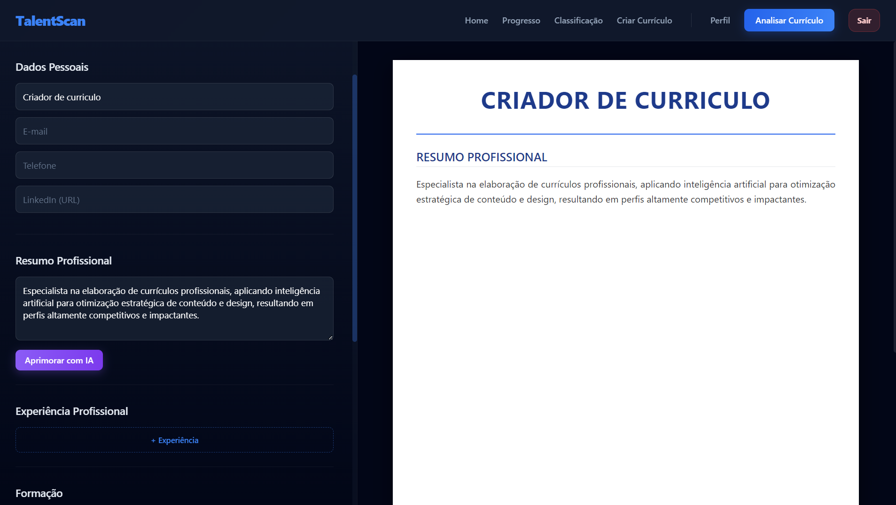
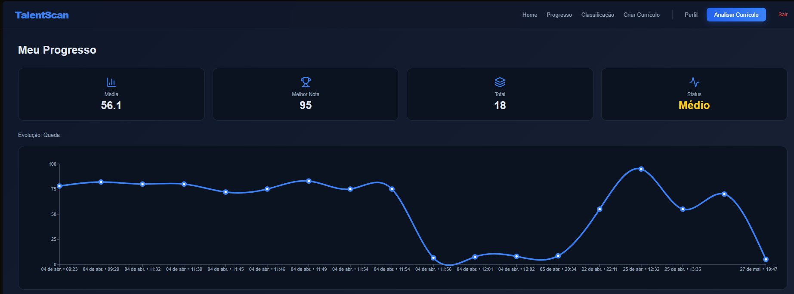
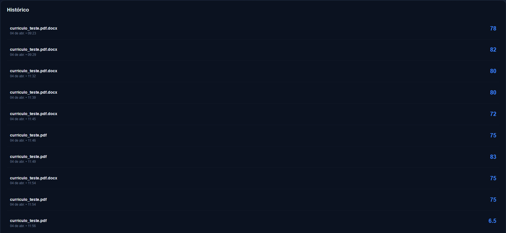

# 5. Interface do Sistema

## 5.1. Galeria de Telas (Por Sprint)

**🟢 Sprint 1: Hello World / Tela Inicial**
* **Funcionalidade:** Ponto de entrada do sistema e navegação principal (tela Home conectada à API).
* **Descrição:** Tela inicial do TalentScan, exibindo o menu de navegação (Home, Login, etc.) e provando a conexão com o backend (ex.: carregamento de dados básicos via API). Inclui links para cadastro e login.

**🟡 Sprint 2: MVP (Primeira Fatia Vertical)**
* **Funcionalidade:** Autenticação de usuários (Login e Cadastro) + Upload de currículos.
* **Descrição:** Formulários interativos para registro de usuários e login, enviando dados para a API e salvando no banco. Inclui upload de PDFs de currículos, com validação e feedback de sucesso/erro.

* 
* 
* 
* 
* 

**🔵 Sprint 3: Core (Regras de Negócio)**
* **Funcionalidade:** Análise de currículos com IA e compatibilidade com vagas, histórico, envio do currículo e Criador de Currículo.
* **Descrição:** Dashboard principal para análise de currículos enviados, exibindo resultados de compatibilidade (pontuações, classificações) gerados pela IA. Inclui listagem de análises históricas, detalhes de compatibilidade por vaga e o novo Criador de Currículo para edição manual e exportação em PDF. A interface recebeu refinamentos na Navbar para facilitar a navegação e botões interativos (CTA) para as ações principais.

* 
* 
* 
* 
* 
* 
* 
* 
* 
* 

**🔴 Sprint 4: Entrega Final**
* **Funcionalidade:** Dashboard de Progresso, métricas de desempenho e refinamentos finais do sistema.
* **Descrição:** Nesta etapa foram realizados ajustes finais, correção de bugs, testes de funcionalidades e refinamento da experiência do usuário. Também foi concluída a tela de Progresso, permitindo ao usuário acompanhar sua evolução por meio de indicadores como média das análises, melhor nota obtida, quantidade total de análises realizadas, classificação de desempenho e gráfico de evolução ao longo do tempo. A tela também disponibiliza o histórico detalhado das análises realizadas, facilitando o acompanhamento dos resultados e da evolução do currículo.

* 

* 

