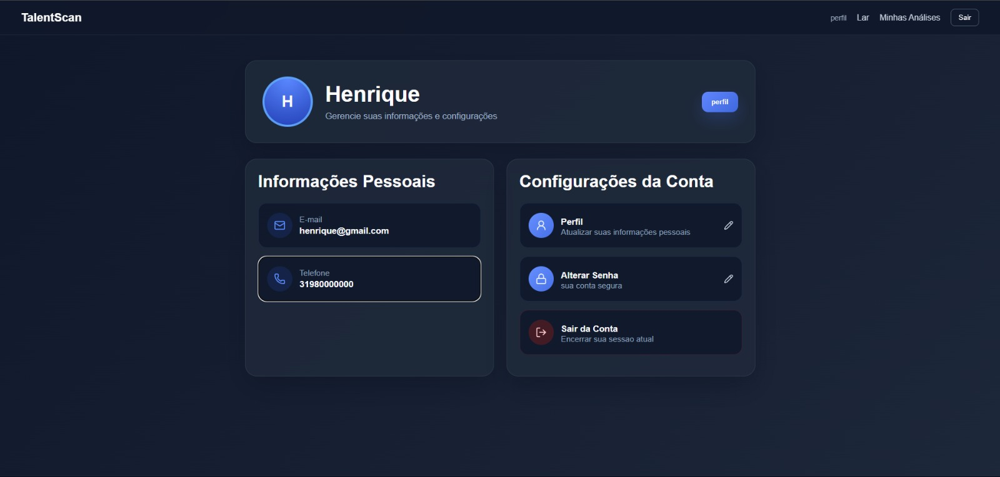
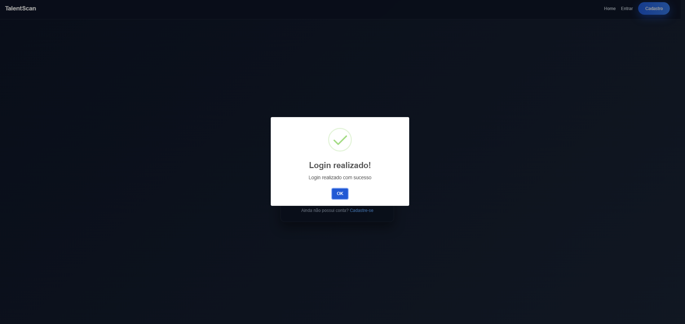
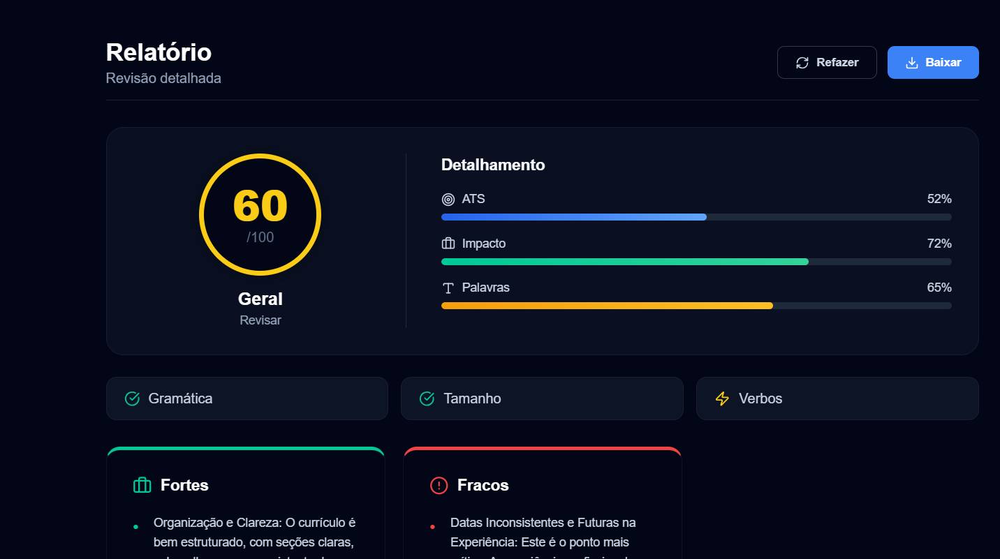
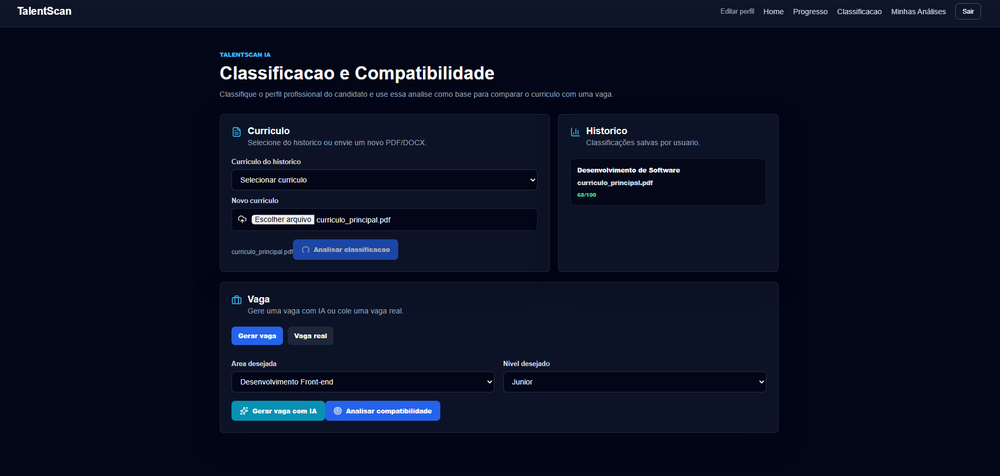
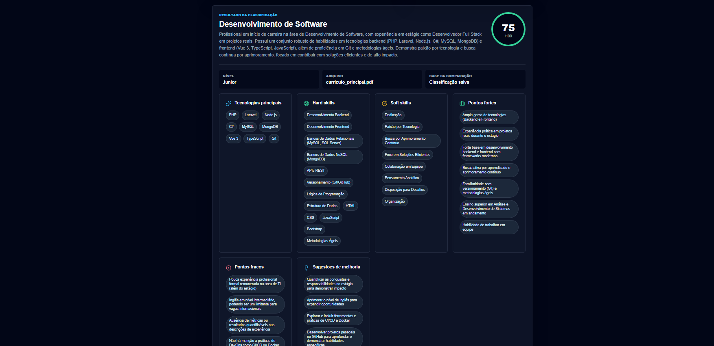
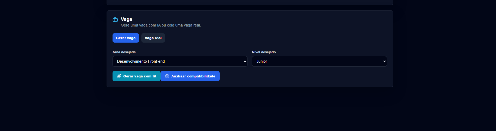
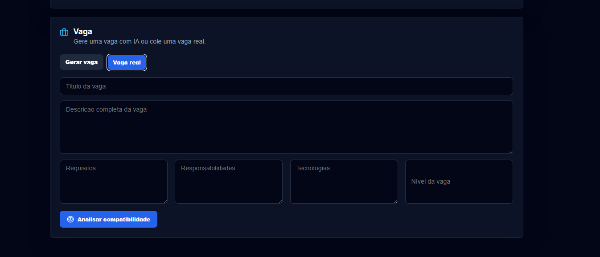
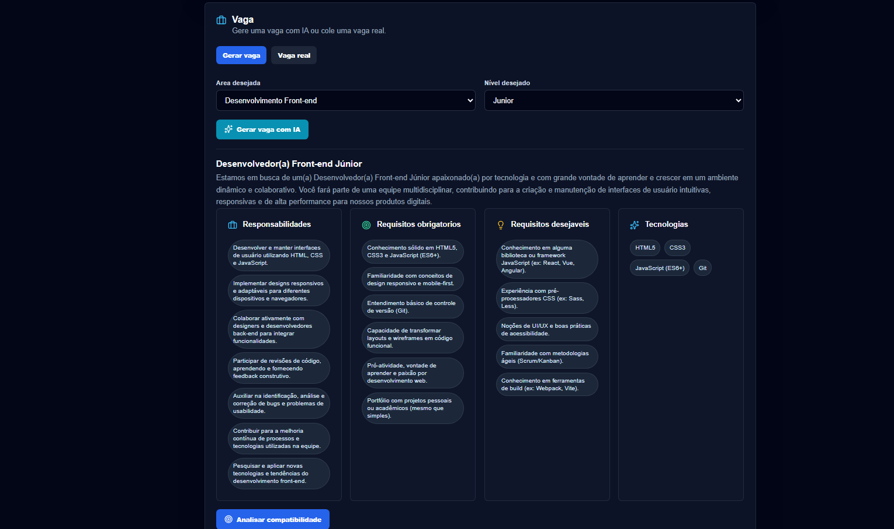
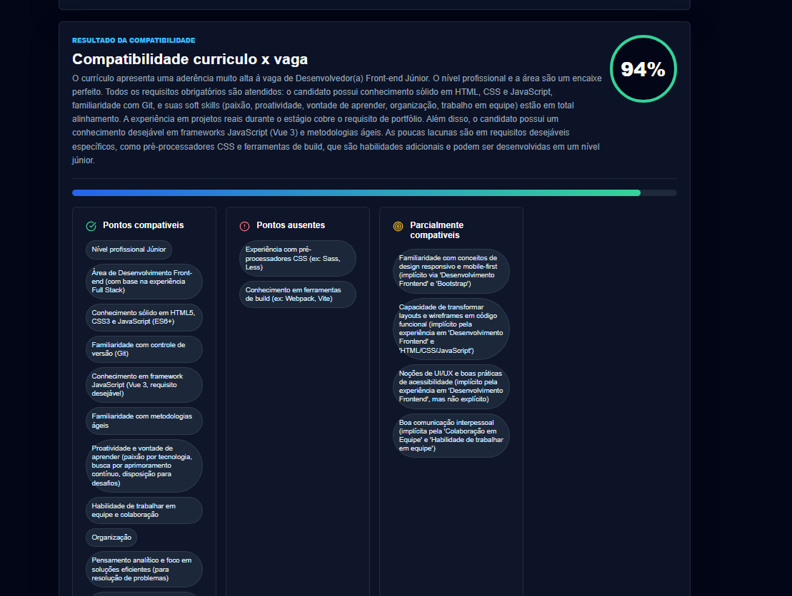
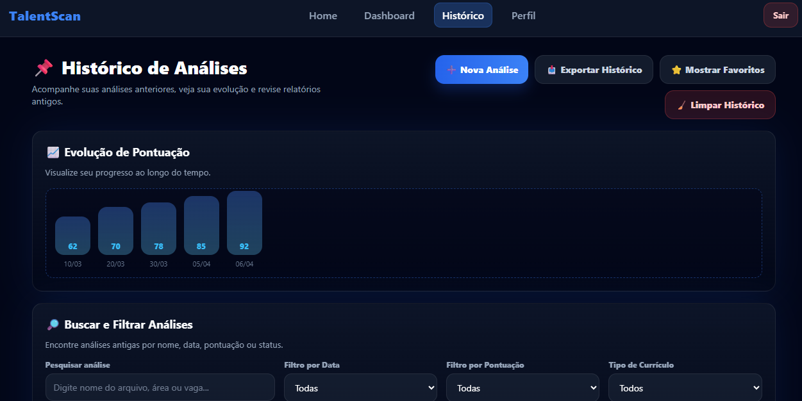

# 5. Interface do Sistema

> ⚠️ **Aviso aos Squads:**
> Diferente da Seção 4 (onde vocês colocaram os wireframes/Mockups), esta seção é o **Portfólio Visual** do software real. Aqui devem constar apenas as capturas de tela (screenshots) do **sistema já codificado e funcionando**.

Esta seção deve ser atualizada a cada Sprint, servindo como um registro histórico da evolução da interface da aplicação web.   

## 5.1. Galeria de Telas (Por Sprint)

Apresente as imagens reais das telas implementadas, associando-as à funcionalidade (Fatia Vertical) entregue na Sprint correspondente. Descreva brevemente o que cada tela faz.  

**🟢 Sprint 1: Hello World / Tela Inicial**
* **Funcionalidade:** Ponto de entrada do sistema e navegação principal (tela Home conectada à API).
* **Descrição:** Tela inicial do TalentScan, exibindo o menu de navegação (Home, Login, etc.) e provando a conexão com o backend (ex.: carregamento de dados básicos via API). Inclui links para cadastro e login.
* 
* 
* 

  
> 💡 **Importante:** Uma mesma funcionalidade (fatia) pode render **várias telas** (ex: tela de listagem, formulário de cadastro e modal de sucesso). **Coloque prints de todas as etapas do fluxo.**   

**🟡 Sprint 2: MVP (Primeira Fatia Vertical)**
* **Funcionalidade:** Autenticação de usuários (Login e Cadastro) + Upload de currículos.
* **Descrição:** Formulários interativos para registro de usuários e login, enviando dados para a API e salvando no banco. Inclui upload de PDFs de currículos, com validação e feedback de sucesso/erro.

* 
* 
* 
* 
* 
  
> 💡 **Importante:** Uma mesma funcionalidade (fatia) pode render **várias telas** (ex: tela de listagem, formulário de cadastro e modal de sucesso). **Coloque prints de todas as etapas do fluxo.**   

**🔵 Sprint 3: Core (Regras de Negócio)**
* **Funcionalidade:** Análise de currículos com IA e compatibilidade com vagas, histórico e envio do curriculo.
* **Descrição:** Dashboard principal para análise de currículos enviados, exibindo resultados de compatibilidade (pontuações, classificações) gerados pela IA. Inclui listagem de análises históricas e detalhes de compatibilidade por vaga.

* 
* 
* 
* 
* 
* 
* 
* 
* 

  
> 💡 **Importante:** Uma mesma funcionalidade (fatia) pode render **várias telas** (ex: tela de listagem, formulário de cadastro e modal de sucesso). **Coloque prints de todas as etapas do fluxo.**   

**🔴 Sprint 4: Entrega Final**
* **Funcionalidade:** Polimento visual e telas secundárias.
* **Descrição:** Telas finais de relatórios, perfis de usuário, tratamento de erros e refinamento de CSS/UX.
* *(Insira a imagem real da tela aqui - ex: ``)*   
> 💡 **Importante:** Uma mesma funcionalidade (fatia) pode render **várias telas** (ex: tela de listagem, formulário de cadastro e modal de sucesso). **Coloque prints de todas as etapas do fluxo.**   

> 📸 **Dica:** Certifiquem-se de que as imagens tenham boa resolução e mostrem o sistema rodando no navegador. Salvem todas as imagens na pasta `images/` do repositório.

